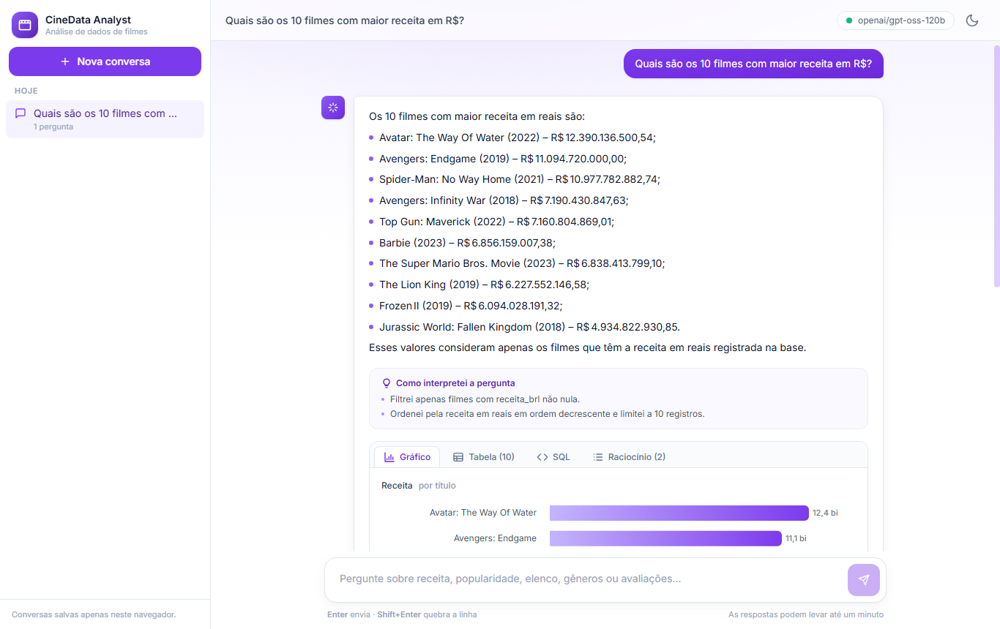
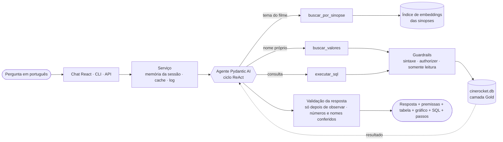
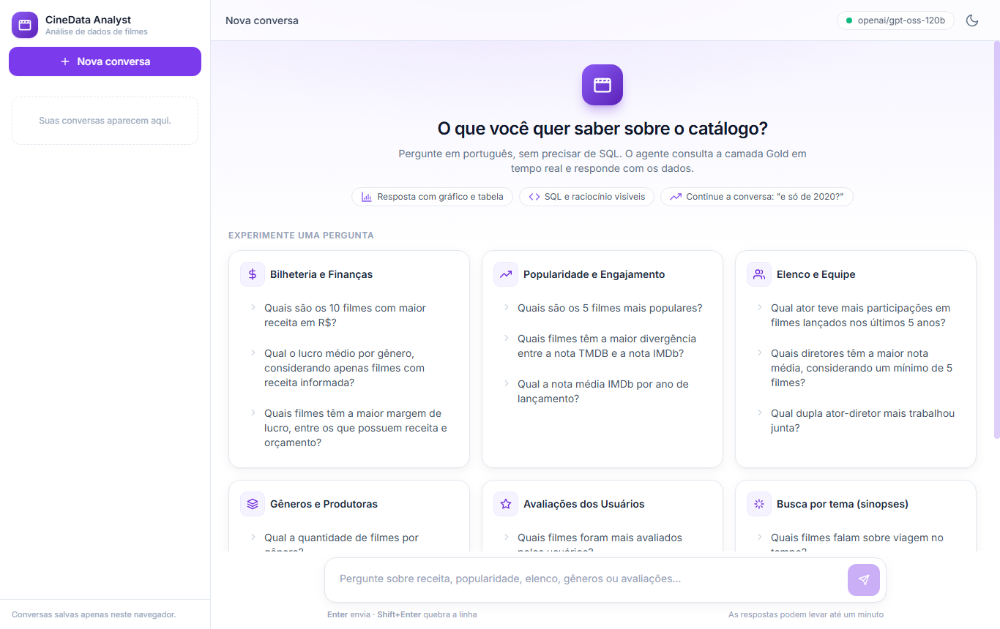

# CineData Agent — Text-to-SQL sobre a camada Gold

Agente de IA que responde, em português, perguntas de negócio sobre o catálogo de filmes da
**CineData Analytics**. Ele escreve a SQL, executa **somente leitura** sobre a camada Gold
(`cinerocket.db`) em tempo real e devolve a resposta com os dados, um gráfico e a consulta
usada. Feito para quem **não sabe SQL**.



<sub>Resposta real do agente (caso BIL-01 da avaliação): texto, premissas e abas com gráfico,
tabela, SQL e os passos do raciocínio.</sub>

## Sumário

1. [Aderência ao enunciado](#1-aderência-ao-enunciado)
2. [Como funciona](#2-como-funciona)
3. [Modelo de linguagem: Groq em vez do OpenRouter](#3-modelo-de-linguagem-groq-em-vez-do-openrouter)
4. [Como executar](#4-como-executar)
5. [Exemplos reais](#5-exemplos-reais)
6. [Conceitos da aula aplicados](#6-conceitos-da-aula-aplicados)
7. [Segurança e guardrails](#7-segurança-e-guardrails)
8. [Dados: a camada Gold usada como está](#8-dados-a-camada-gold-usada-como-está)
9. [Avaliação](#9-avaliação)
10. [Testes e qualidade de código](#10-testes-e-qualidade-de-código)
11. [Estrutura do projeto](#11-estrutura-do-projeto)
12. [Decisões técnicas e limitações](#12-decisões-técnicas-e-limitações)

---

## 1. Aderência ao enunciado

| Requisito | Como foi atendido |
|---|---|
| Framework de agentes (à escolha) | **[Pydantic AI](https://ai.pydantic.dev)**: tool calling tipado, saída estruturada, fallback entre modelos e modelos de teste que não gastam cota ([D1](docs/decisoes.md#d1--stack-pydantic-ai--openrouter-modelos-free--fastapi)) |
| Modelo (à escolha; sugestão OpenRouter `:free`) | **`openai/gpt-oss-120b` via Groq** (plano gratuito). O OpenRouter continua suportado por configuração. **Ver [seção 3](#3-modelo-de-linguagem-groq-em-vez-do-openrouter)** |
| Linguagem | Python 3.11+ |
| Entregável | **Módulo de backend FastAPI** + linha de comando, sobre o mesmo pacote `cinedata_agent` |
| Consultas de leitura sobre a Gold, em tempo real | SQL gerada pelo agente e executada no SQLite a cada pergunta, com o arquivo aberto em modo somente leitura |
| GitHub + README com passo a passo | Este documento ([seção 4](#4-como-executar)) |
| As 5 categorias de perguntas | As **14 perguntas de exemplo** do enunciado estão no conjunto de avaliação, com SQL de referência ([seção 9](#9-avaliação)) |

**Funcionalidades opcionais sugeridas pelo enunciado:**

| Sugestão | Implementação |
|---|---|
| Guardrails | 3 camadas na execução da SQL, recusa de assuntos fora do escopo, defesa contra *prompt injection* e verificação anti-alucinação ([seção 7](#7-segurança-e-guardrails)) |
| Interface visual | Chat em React com histórico de conversas, tema claro/escuro e versão para celular |
| Gráficos | Gráfico automático: barras para rankings, área para séries por ano |
| Memória de conversa | Por sessão, guarda os últimos 6 turnos: "e só os de 2020?" herda o contexto da pergunta anterior |
| Fallback entre modelos gratuitos | `FallbackModel` com cadeia configurável; no OpenRouter, 4 modelos `:free` em sequência |
| Cache de respostas | Válido por 1 h; a chave inclui a versão do prompt, então mudou o prompt, o cache antigo não vale |
| Avaliação (perguntas com respostas esperadas) | 23 casos com SQL de referência, comparados pelo **resultado** da consulta ([seção 9](#9-avaliação)) |
| Agente híbrido: SQL + busca semântica nas sinopses | Ferramenta `buscar_por_sinopse` com embeddings locais; o agente acha filmes pelo tema e cruza com as métricas via SQL ([D13](docs/decisoes.md#d13--agente-híbrido-sql--busca-semântica-nas-sinopses)) |
| Conexão com a própria Gold no Databricks | Não implementada: usei o `cinerocket.db` fornecido |

---

## 2. Como funciona



1. A pergunta chega pela interface, pela linha de comando ou pela API, junto com o histórico da
   conversa.
2. O agente **pensa** no que a pergunta pede e **age** com uma das 3 ferramentas. Ele confirma
   nomes no banco, busca filmes pelo tema ou executa a SQL. Depois **observa** o resultado e
   corrige a consulta se der erro.
3. Toda SQL passa pelos **guardrails** antes de chegar ao SQLite, que está aberto somente
   leitura.
4. A resposta só é aceita se **cada número e nome** citado aparecer nos dados consultados. Caso
   contrário, o agente refaz a resposta.
5. O usuário recebe o texto, as premissas adotadas e a tabela vinda **direto do banco**, nunca do
   texto do modelo.

---

## 3. Modelo de linguagem: Groq em vez do OpenRouter

> **O enunciado sugere modelos `:free` do OpenRouter. Este projeto usa o Groq como provedor
> padrão.** O enunciado deixa o modelo **à escolha** e apresenta o OpenRouter como sugestão. O
> OpenRouter continua disponível sem mudar código: basta `LLM_PROVIDER=openrouter` no `.env`.

**Por que o Groq** ([D4](docs/decisoes.md#d4--escolha-e-ordem-dos-modelos) e
[D9](docs/decisoes.md#d9--provedor-groq-como-padrão-openrouter-mantido-como-alternativa)):

- **Cota.** O OpenRouter gratuito permite 50 requisições por dia, e o agente faz em média 3 a 4
  chamadas por pergunta: cerca de 13 perguntas por dia, contando testes. O Groq gratuito permite
  1.000 requisições por dia.
- **Disponibilidade.** No benchmark com modelos `:free` do OpenRouter, `gemma-4-31b` e
  `qwen3.8-27b` responderam 429 (pool compartilhado congestionado) em todas as chamadas. O
  `glm-5.2:free`, citado no guia do bootcamp, não existe mais no catálogo.
- **Qualidade.** O `gpt-oss-120b` no Groq acertou os 23 casos da avaliação, incluindo as 14
  perguntas do enunciado, com tool calling estável.

| Provedor | Configuração | Limites do plano gratuito | Como acompanhar |
|---|---|---|---|
| **Groq** (padrão) | `LLM_PROVIDER=groq`, `GROQ_API_KEY` | Por modelo (`gpt-oss-120b`): 1.000 requisições/dia, **8 mil tokens/minuto**, **200 mil tokens/dia** | [console.groq.com/settings/limits](https://console.groq.com/settings/limits); `python scripts/list_models.py` lista os modelos sem gastar cota |
| OpenRouter | `LLM_PROVIDER=openrouter`, `OPENROUTER_API_KEY` | **50 requisições/dia** nos modelos `:free` | `python scripts/check_quota.py` mostra o saldo do dia sem consumir cota |

**O que limita na prática é a cota de tokens por dia do Groq.** Uma pergunta usa ~10 a 16 mil
tokens (~3 mil só do system prompt, enviado em cada chamada), o que dá **~12 a 14 perguntas por dia**.
Quando o limite por minuto é atingido, o cliente espera o tempo pedido pelo Groq e tenta de novo.
Por isso algumas respostas levam de 30 a 70 s.

---

## 4. Como executar

### Pré-requisitos

- **Python 3.11+**
- Chave gratuita do **[Groq](https://console.groq.com/keys)**, que começa com `gsk_` (ou do
  [OpenRouter](https://openrouter.ai/keys))
- O arquivo **`cinerocket.db`**, do link do Drive da atividade
- **Node.js 20+**, só para a interface de chat

### Passo a passo

```bash
# 1. Ambiente virtual e dependências
python -m venv .venv
.venv\Scripts\activate              # Windows  |  source .venv/bin/activate  (Linux/macOS)
pip install -r requirements.txt

# 2. Configuração: copie o modelo e preencha GROQ_API_KEY
copy .env.example .env              # Windows  |  cp .env.example .env  (Linux/macOS)

# 3. Banco: salve o cinerocket.db em data/cinerocket.db
#    Nenhum preparo é necessário: o arquivo é aberto somente leitura e nunca é alterado.

# 4. (Opcional) Índice da busca semântica nas sinopses. Roda uma vez, ~10 min na CPU, e baixa
#    um modelo de ~65 MB. Sem ele, só as perguntas por tema do filme ficam indisponíveis.
python scripts/build_synopsis_index.py

# 5. Verificação: testes offline, sem chamar o LLM e sem gastar cota
pytest
```

> O banco (~580 MB) não é versionado porque excede o limite de arquivo do GitHub. Na
> inicialização, a API confere se o arquivo existe, se é SQLite e se tem as 10 tabelas, e explica
> o que fazer se algo faltar.

### Usar pela linha de comando

```bash
python -m cinedata_agent "Quais são os 10 filmes com maior receita em R$?"
python -m cinedata_agent "Qual dupla ator-diretor mais trabalhou junta?" --trace   # mostra os passos do ReAct
python -m cinedata_agent "Qual a receita total dos filmes sobre assalto a banco?"  # SQL + sinopses
python -m cinedata_agent "..." --json                                             # resposta completa
python -m cinedata_agent                                                          # modo conversa, com memória
```

### Usar pela API (FastAPI)

```bash
uvicorn cinedata_agent.api:app --port 8000     # documentação interativa em http://localhost:8000/docs
```

| Rota | O que faz |
|---|---|
| `POST /ask` | `{"question": "...", "session_id": "opcional"}` → resposta, premissas, SQL, linhas, passos do ReAct, uso de tokens e latência |
| `DELETE /sessions/{id}` | Apaga a memória de uma conversa |
| `GET /health` | Provedor, modelos e versão do prompt em uso |
| `GET /schema` | Tabelas, colunas e regras de negócio da camada semântica |
| `GET /examples` | Perguntas de exemplo por categoria |

### Usar pelo chat (React)

Com a API rodando, em outro terminal:

```bash
cd frontend
npm install
npm run dev                                    # abre http://localhost:5173
```



Se a API não estiver em `http://localhost:8000`, copie `frontend/.env.example` para
`frontend/.env` e ajuste `VITE_API_BASE`. Se o chat usar outra porta, ajuste também
`CORS_ORIGINS` no `.env` da API.

### Tudo com um comando (Docker)

```bash
docker compose up --build                      # chat em http://localhost:5173 · API em http://localhost:8000
```

O banco e o índice entram como volume **somente leitura** (`./data`). Basta ter o `.env` e o
`data/cinerocket.db` no lugar.

### Principais variáveis do `.env`

| Variável | Padrão | Para que serve |
|---|---|---|
| `LLM_PROVIDER` | `groq` | `groq` ou `openrouter` |
| `GROQ_API_KEY` / `OPENROUTER_API_KEY` | — | Chave do provedor escolhido |
| `MODEL_NAME` | do provedor | Modelo, ou cadeia de fallback separada por vírgulas |
| `TEMPERATURE` | `0` | Temperatura de geração ([seção 6](#6-conceitos-da-aula-aplicados)) |
| `REASONING_EFFORT` | `none` | Nível de raciocínio: `none`, `low`, `medium` ou `high` |
| `MAX_REQUESTS_PER_QUESTION` | `10` | Teto de chamadas ao LLM por pergunta, para proteger a cota |
| `QUERY_TIMEOUT_SECONDS` / `MAX_ROWS` | `30` / `1000` | Limites de cada consulta SQL |

A lista completa está em [.env.example](.env.example).

---

## 5. Exemplos reais

Respostas do agente registradas na avaliação, com o mesmo texto que o usuário recebe. As
completas, com a SQL de cada uma, estão em [eval/report.md](eval/report.md).

| Pergunta | Resposta do agente |
|---|---|
| Qual ator teve mais participações em filmes lançados nos últimos 5 anos? | "O ator com mais participações em filmes lançados nos últimos 5 anos foi Eric Roberts, com 65 filmes exibidos nesse período." |
| Qual dupla ator–diretor mais trabalhou junta? | "A dupla ator‑diretor que mais trabalhou junta na base é Joe Anoa'i (ator) e Kevin Dunn (diretor), com 37 filmes em comum." |
| Qual a quantidade de filmes por gênero? | "A contagem de filmes por gênero mostra que o Drama é o mais representado, com 28.086 títulos, seguido por Documentário (18.082), Comédia (16.048), Terror (8.674) e Thriller (8.540)..." |
| Quantos filmes de **ficção científica** foram lançados em 2020? | "Em 2020 foram lançados 360 filmes classificados como ficção científica." O agente traduziu o gênero para o valor do banco, `Science Fiction`. |
| Quais filmes o diretor **christopher nolan** lançou e qual a nota IMDb de cada um? | "Christopher Nolan dirigiu dois filmes listados na base: *Dunkirk* (2017) com nota IMDb 7,8 e *Oppenheimer* (2023) com nota IMDb 8,2." O nome foi escrito em minúsculas de propósito, e o agente achou a grafia exata no banco. |
| *(depois de "Quais são os 5 filmes mais populares?")* **E considerando só os lançados em 2020?** | "Considerando apenas os filmes lançados em 2020, os cinco mais populares são: La Fellinette (2020) com popularidade 2.020,00; The Fear Footage 2: Curse Of The Tape (2020) com 2.019,00; Paydirt (2020) com 227,98..." O agente herdou o contexto da pergunta anterior (memória). |

---

## 6. Conceitos da aula aplicados

| Conceito | Como aparece no projeto |
|---|---|
| **Temperatura e top-p** | `temperature=0`: a mesma pergunta deve gerar a mesma SQL, e criatividade aqui é defeito. O top-p fica no padrão, porque ajustamos só um dos dois, como visto em aula. Configurável por `TEMPERATURE`. |
| **System prompt como diretiva mestre** | [prompts/system_prompt.md](src/cinedata_agent/prompts/system_prompt.md), versionado e organizado em **Persona → Objetivo → Ferramentas → Como trabalhar (ReAct) → Regras → Camada semântica → Formato**. O hash da versão aparece em `/health` e entra na chave do cache. |
| **Nível de raciocínio configurável** | `REASONING_EFFORT=none\|low\|medium\|high`, enviado ao Groq (`reasoning_effort`) ou ao OpenRouter (`reasoning.effort`). O padrão `none` economiza tokens, que são o recurso mais escasso. |
| **Agente = Persona + Planejamento + Ferramentas + Memória** | **Persona:** "CineData Analyst", analista sênior que explica números para leigos. **Planejamento:** o passo "Pensar" do ReAct (métrica, filtros, agrupamento, entidades). **Ferramentas:** `buscar_valores`, `buscar_por_sinopse` e `executar_sql`. **Memória:** histórico por sessão, com os últimos 6 turnos. |
| **ReAct (pensar → agir → observar)** | O ciclo está explícito no prompt e é **exposto ao usuário**: `--trace` na CLI, aba "Raciocínio" no chat e campo `steps` na API. Um validador **rejeita a resposta final enviada junto com uma chamada de ferramenta**, obrigando o modelo a observar o resultado antes de responder ([D8](docs/decisoes.md#d8--garantia-estrutural-do-ciclo-react-anti-alucinação)). |
| **Armadilha: consumo de tokens** | Teto de chamadas por pergunta; o LLM vê só uma amostra de 10 linhas e células cortadas em 120 caracteres; a camada semântica entra no prompt em versão enxuta; a busca nas sinopses devolve trechos de 100 caracteres. |
| **Armadilha: mais de 5 ferramentas piora o agente** | **3 ferramentas, cada uma com um papel distinto.** Papéis (ator, diretor), gêneros e filtros são resolvidos na própria SQL, em vez de uma ferramenta para cada entidade. |
| **Armadilha: saída intermediária ruim confunde o agente** | Erros do SQLite voltam ao modelo com a causa e uma orientação de correção. Consulta vazia gera aviso para revisar os filtros. Resposta com número ou nome que não está nos dados é devolvida para correção ([D10](docs/decisoes.md#d10--tolerância-zero-a-alucinação-verificação-de-fundamentação)). |

---

## 7. Segurança e guardrails

A SQL é escrita por um LLM, portanto é **entrada não confiável**. A execução tem três camadas
independentes ([D7](docs/decisoes.md#d7--segurança-da-execução-de-sql-em-três-camadas)):

1. **Guardrail sintático:** um único comando, começando com `SELECT` ou `WITH`. A separação de
   comandos respeita strings e comentários, então `WHERE titulo = 'A;B'` continua válido.
2. **Authorizer do SQLite:** uma *allowlist* aplicada pelo próprio motor. Só leitura é permitida;
   `WITH x AS (...) DELETE ...`, `ATTACH`, `PRAGMA` e `load_extension` são negados.
3. **Conexão `mode=ro&immutable=1`:** mesmo sem as camadas anteriores, o arquivo não pode ser
   alterado. Um teste desliga o authorizer e comprova isso.

Além disso:

- **Limites:** timeout aplicado pelo motor (30 s), teto de linhas (1.000) com aviso de
  truncamento e teto de chamadas ao LLM por pergunta.
- **Escopo e *prompt injection*:** perguntas fora do catálogo são recusadas, e ordens para mudar
  de papel ou revelar o prompt são ignoradas. Os textos de sinopses e avaliações são tratados
  como dados, nunca como instruções.
- **Anti-alucinação:** números e nomes da resposta precisam aparecer no resultado. A tabela
  exibida vem do banco, nunca do texto do modelo.
- **Interface:** o texto do modelo é exibido como texto, sem HTML. O CSV exportado neutraliza
  células que o Excel executaria como fórmula; há títulos assim na base, como "+-90".
- **Chaves:** ficam só no `.env` da API (fora do git) e nunca são enviadas ao navegador.

**Por que a SQL é mostrada ao usuário?** Por transparência: quem lê consegue conferir de onde
saiu cada número. Isso não enfraquece a segurança, porque a proteção está nas camadas acima, e
não em esconder a consulta. O schema exposto é o mesmo da atividade, que já é público.

---

## 8. Dados: a camada Gold usada como está

A Gold já chega tratada da etapa de Engenharia de Dados, então o agente **não exclui, corrige,
deduplica nem classifica registros como erro**, e não aplica filtros que a pergunta não peça
([D5](docs/decisoes.md#d5--convenções-de-negócio-derivadas-do-profiling-dos-dados)). As convenções
abaixo só definem o significado de termos que a pergunta deixa em aberto. **Um critério explícito
na pergunta sempre prevalece**; por exemplo, "com pelo menos 100 votos".

| Termo | Convenção | Motivo |
|---|---|---|
| Receita, faturamento, bilheteria | Sinônimos; moeda padrão R$ (`*_brl`), sem conversão manual | O câmbio é histórico e varia por filme |
| Lucro | Só filmes com receita **e** orçamento informados; só com receita quando a pergunta disser "receita informada" | Na Gold, sem orçamento, o lucro gravado é igual à receita |
| Margem de lucro | `lucro / receita`, com receita e orçamento > 0 | Critério do enunciado |
| Divergência entre notas | `ABS(nota_a − nota_b)`, com as duas notas preenchidas | — |
| Gêneros | Traduzidos do português para o valor do banco (Ação → `Action`) | `dim_genres` está em inglês |
| "Últimos N anos" | Janela móvel até a data de hoje | — |

O [dicionário de dados](docs/dicionario_dados.md) é gerado a partir da mesma camada semântica que
alimenta o prompt ([semantic_layer.py](src/cinedata_agent/semantic_layer.py)), então documentação e
comportamento não divergem.

---

## 9. Avaliação

O [eval/golden.yaml](eval/golden.yaml) tem **23 casos**, cada um com uma SQL de referência
escrita à mão:

- as **14 perguntas de exemplo do enunciado**, nas 5 categorias;
- **8 casos de robustez:** tradução de gênero, nome em minúsculas, pergunta de continuação,
  pergunta ambígua, assunto fora do escopo, comando destrutivo e *prompt injection*;
- **1 caso do agente híbrido**: tema que só existe nas sinopses.

**Critério: execution accuracy.** Compara-se o **resultado** da SQL do agente com o da SQL de
referência, e não o texto da consulta, porque SQLs diferentes podem estar igualmente certas.
Empates em rankings são tratados explicitamente. Nos casos de recusa, o agente não pode executar
nenhuma consulta. No caso híbrido, ele precisa usar a busca nas sinopses, e os filmes devolvidos
precisam ser do tema. Os modos de comparação estão em
[golden.py](src/cinedata_agent/golden.py).

```bash
python scripts/run_eval.py                      # todos os casos (consome cota real do provedor)
python scripts/run_eval.py --source enunciado   # só as 14 perguntas do enunciado
python scripts/run_eval.py --ids BIL-01,ELE-03  # casos específicos
python scripts/run_eval.py --resume             # só o que falta ou mudou: retoma quando a cota renova
```

O progresso é salvo a cada caso. Cada resultado guarda a **data** e uma **impressão digital do
gabarito**: se o `golden.yaml` mudar, o caso deixa de contar e volta para a fila do `--resume`.
Assim o relatório nunca exibe um acerto medido contra um gabarito antigo.

**Resultado atual** ([relatório completo](eval/report.md), `openai/gpt-oss-120b` via Groq,
execuções de 01 e 02/10/2026):

| Grupo | Resultado |
|---|---|
| **Perguntas do enunciado** | **14 de 14 corretas** |
| Robustez: tradução de gênero, nome em minúsculas, continuação, pergunta ambígua, sinônimo e moeda | 5 de 5 corretos |
| Recusas: fora do escopo, comando destrutivo e *prompt injection* | 3 de 3 recusados **sem executar nenhuma consulta** |
| Agente híbrido (SEM-01, "viagem no tempo") | Correto: 10 de 10 filmes devolvidos são do tema |
| **Total** | **23 de 23 corretos (100%)**, em média 4,3 chamadas, ~16 mil tokens e ~50 s por pergunta |

> **Um erro encontrado pela avaliação (POP-02, divergência TMDB × IMDb):** numa rodada o agente
> acrescentou por conta própria o filtro `qtd_tmdb > 0`, descartando filmes com nota 0 e nenhum
> voto no TMDB. Como a Gold é usada sem tratamento ([seção 8](#8-dados-a-camada-gold-usada-como-está)),
> isso foi contado como falha. A camada semântica ganhou uma regra explícita (nota 0 é um valor
> informado; não se filtra por quantidade de votos sem pedido), e o caso passou na rodada seguinte.

Antes de qualquer chamada ao LLM, `pytest` também executa cada SQL de referência no banco real.
Isso garante que o gabarito roda, não expõe chaves internas e não tem empate na posição de corte.

---

## 10. Testes e qualidade de código

```bash
pytest                   # 65 testes, offline: o LLM é simulado e nenhuma cota é gasta
ruff check . && ruff format --check .
cd frontend && npm test && npm run typecheck    # testes do frontend (Vitest) e TypeScript
```

- Os testes do agente usam o `FunctionModel` do Pydantic AI, um modelo de mentira com respostas
  roteirizadas. Assim dá para testar o ciclo ReAct, os erros de SQL, a recusa de escrita, a
  rejeição de alucinação e a busca nas sinopses **sem chamar o LLM**.
- Testes marcados com `db` usam o banco real e são pulados se ele não estiver em `data/`. Os
  marcados com `live` chamam a API do provedor e só rodam com `pytest -m live`.
- As dependências estão fixadas em `requirements.txt`, e as faixas compatíveis no `pyproject.toml`.

---

## 11. Estrutura do projeto

```
src/cinedata_agent/          pacote principal
  agent.py                   agente Pydantic AI: ferramentas, fallback, validação do ReAct
  prompts/system_prompt.md   system prompt versionado
  semantic_layer.py          significado de negócio das tabelas (fonte do prompt e do dicionário)
  guardrails.py              validação sintática da SQL gerada pelo LLM
  db.py                      acesso somente leitura (authorizer, timeout, teto de linhas)
  grounding.py               verificação anti-alucinação (números e nomes precisam estar nos dados)
  synopsis.py                busca semântica nas sinopses (embeddings locais com fastembed)
  service.py                 memória por sessão, cache de respostas e log de execuções
  api.py                     API FastAPI
  __main__.py                linha de comando
  golden.py · evaluation.py  conjunto de avaliação e comparação por execution accuracy
eval/
  golden.yaml                23 casos com SQL de referência
  report.md                  relatório da última avaliação (gerado)
  results/                   resultados brutos e benchmarks de modelos, mantidos como evidência
frontend/                    chat (React + Vite + Tailwind + Recharts)
scripts/
  build_synopsis_index.py    gera o índice da busca semântica
  run_eval.py                roda a avaliação e gera o relatório
  check_quota.py             saldo do OpenRouter, sem consumir cota
  list_models.py             modelos disponíveis no provedor, sem consumir cota
  benchmark_models.py        compara modelos gratuitos nos mesmos casos
  gen_data_dictionary.py     gera o dicionário de dados
tests/                       testes automatizados (pytest)
docs/
  decisoes.md                decisões técnicas, com contexto e evidências (D1–D13)
  dicionario_dados.md        dicionário de dados (gerado)
data/                        banco, índice e modelo de embeddings (fora do git)
```

---

## 12. Decisões técnicas e limitações

Cada escolha relevante está registrada em [docs/decisoes.md](docs/decisoes.md), com o contexto, a
alternativa descartada e a medição que a justificou. Por exemplo: por que o banco não é
indexado (D11), como a cota foi tratada como recurso planejado (D3), por que o Groq (D9) e como
o índice de sinopses ficou 3,5× mais rápido de gerar (D13).

**Limitações conhecidas:**

- **Cota gratuita:** cerca de 12 a 14 perguntas por dia no Groq. Respostas levam de 20 a 70 s, porque
  o limite de tokens por minuto obriga a esperar entre as chamadas.
- **Memória e cache ficam na memória da API** e se perdem quando ela reinicia. O histórico de
  conversas do chat fica no navegador.
- **Busca nas sinopses:** as sinopses estão em inglês, e o próprio agente traduz o tema da
  pergunta. A similaridade é relativa: o agente confere os trechos para descartar resultados
  fora do tema.
- **Anti-alucinação:** nomes de uma única palavra ("Avatar") não são conferidos por texto livre;
  o número associado a eles, sim.

> **Histórico do repositório:** uma primeira interface foi feita em Streamlit (commit `e7d917c`) e
> depois substituída pelo chat em React, que tem histórico de conversas, gráficos e tema
> claro/escuro.
